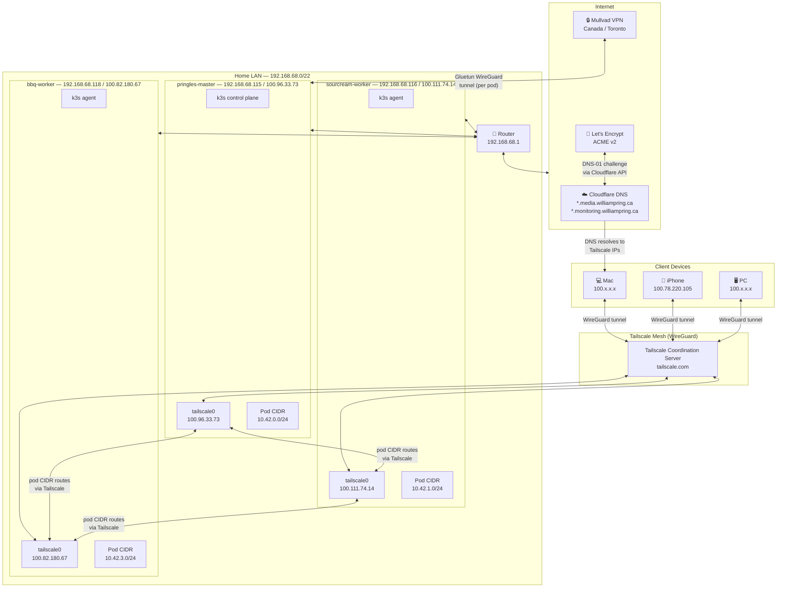

# Network Topology

## Physical + Overlay Network

## Key Points

- All inter-node pod traffic travels over the **Tailscale WireGuard tunnel**, not the LAN
- Each node advertises its pod CIDR (`10.42.x.0/24`) as a Tailscale subnet route
- Client devices reach services via Tailscale IPs (`100.x.x.x`), not LAN IPs
- Cloudflare DNS resolves subdomains to Tailscale IPs (DNS only, no proxy)
- Only media pods (qBittorrent, Arr stack) egress via Mullvad
