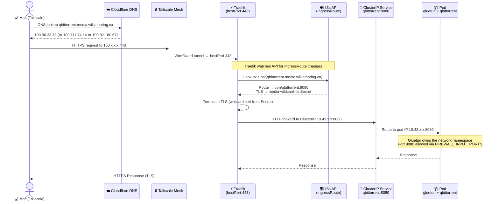
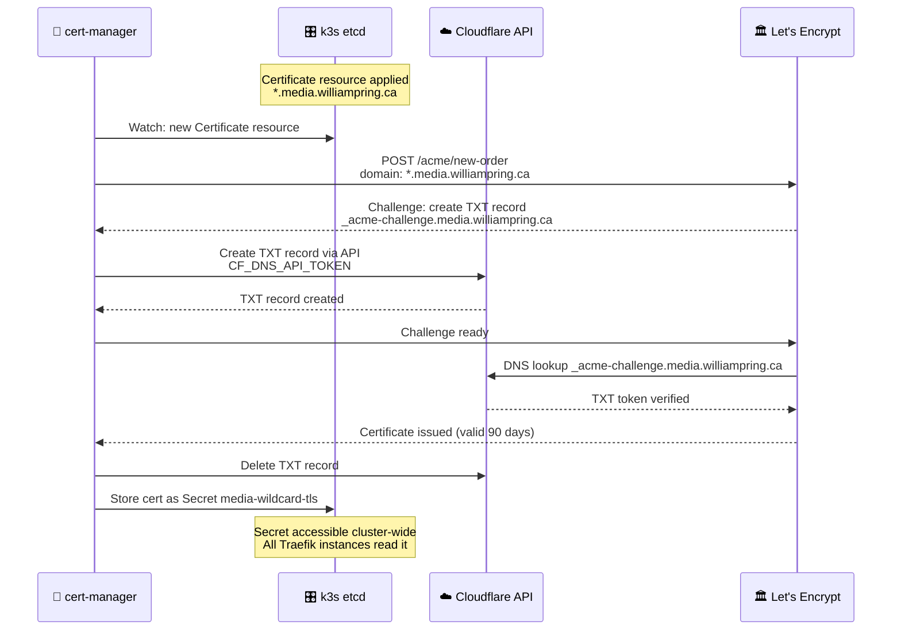

# Request Flow

## HTTPS Request: Mac → qbittorrent.media.williampring.ca

```mermaid
sequenceDiagram
    actor User as 💻 Mac (Tailscale)
    participant CF as ☁️ Cloudflare DNS
    participant TS as 🔒 Tailscale Mesh
    participant Traefik as ⚡ Traefik<br/>(hostPort 443)
    participant K8s as 🎛️ k3s API<br/>(IngressRoute)
    participant SVC as 🔀 ClusterIP Service<br/>qbittorrent:8080
    participant Pod as 📦 Pod<br/>gluetun + qbittorrent

    User->>CF: DNS lookup qbittorrent.media.williampring.ca
    CF-->>User: 100.96.33.73 (or 100.111.74.14 or 100.82.180.67)

    User->>TS: HTTPS request to 100.x.x.x:443
    TS->>Traefik: WireGuard tunnel → hostPort 443

    Note over Traefik,K8s: Traefik watches API for IngressRoute changes
    Traefik->>K8s: Lookup: Host(qbittorrent.media.williampring.ca)
    K8s-->>Traefik: Route → vpn/qbittorrent:8080<br/>TLS → media-wildcard-tls Secret

    Traefik->>Traefik: Terminate TLS (wildcard cert from Secret)
    Traefik->>SVC: HTTP forward to ClusterIP 10.43.x.x:8080
    SVC->>Pod: Route to pod IP 10.42.x.x:8080

    Note over Pod: Gluetun owns the network namespace<br/>Port 8080 allowed via FIREWALL_INPUT_PORTS
    Pod-->>SVC: Response
    SVC-->>Traefik: Response
    Traefik-->>User: HTTPS Response (TLS)
```

## Certificate Issuance Flow

```mermaid
sequenceDiagram
    participant CM as 🔐 cert-manager
    participant K8s as 🎛️ k3s etcd
    participant CF as ☁️ Cloudflare API
    participant LE as 🏛️ Let's Encrypt

    Note over K8s: Certificate resource applied<br/>*.media.williampring.ca

    CM->>K8s: Watch: new Certificate resource
    CM->>LE: POST /acme/new-order<br/>domain: *.media.williampring.ca
    LE-->>CM: Challenge: create TXT record<br/>_acme-challenge.media.williampring.ca

    CM->>CF: Create TXT record via API<br/>CF_DNS_API_TOKEN
    CF-->>CM: TXT record created

    CM->>LE: Challenge ready
    LE->>CF: DNS lookup _acme-challenge.media.williampring.ca
    CF-->>LE: TXT token verified

    LE-->>CM: Certificate issued (valid 90 days)
    CM->>CF: Delete TXT record
    CM->>K8s: Store cert as Secret media-wildcard-tls

    Note over K8s: Secret accessible cluster-wide<br/>All Traefik instances read it
```
