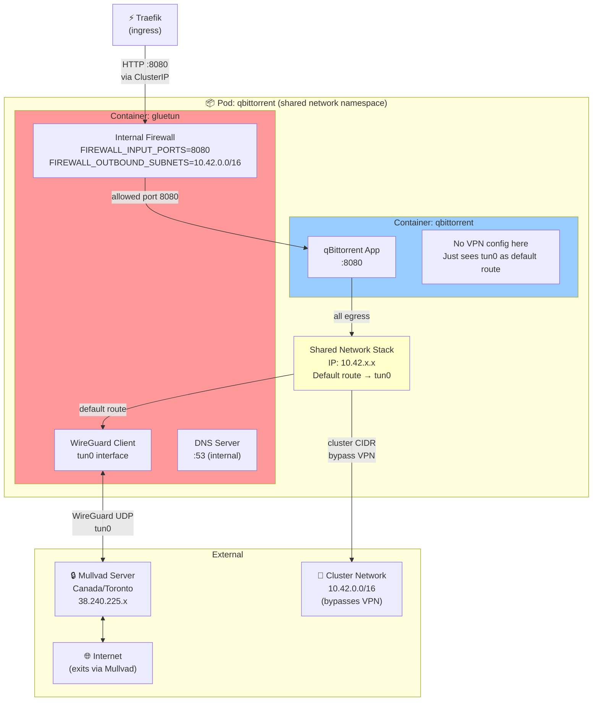
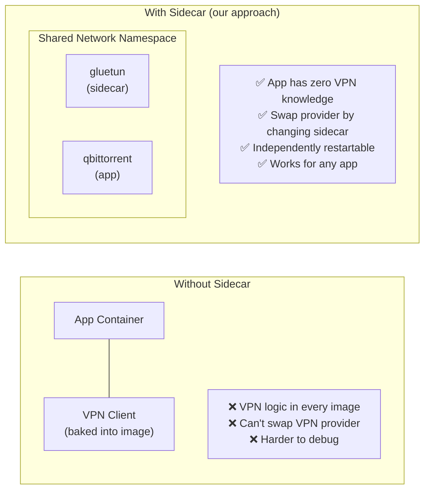
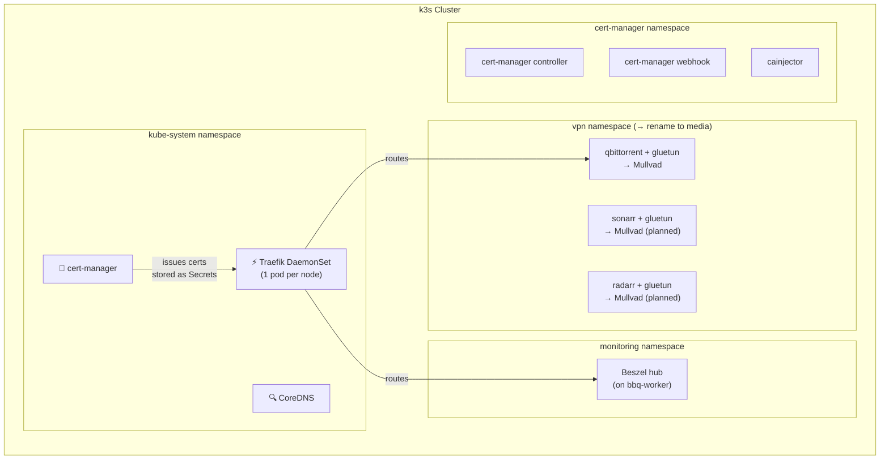

# Pod Architecture

## Gluetun Sidecar Pattern

```mermaid
graph TB
    subgraph Pod["📦 Pod: qbittorrent (shared network namespace)"]
        subgraph Gluetun["Container: gluetun"]
            WG["WireGuard Client\ntun0 interface"]
            FW["Internal Firewall\nFIREWALL_INPUT_PORTS=8080\nFIREWALL_OUTBOUND_SUBNETS=10.42.0.0/16"]
            DNS_G["DNS Server\n:53 (internal)"]
        end

        subgraph QBit["Container: qbittorrent"]
            APP["qBittorrent App\n:8080"]
            NOTE["No VPN config here\nJust sees tun0 as default route"]
        end

        NET["Shared Network Stack\nIP: 10.42.x.x\nDefault route → tun0"]
    end

    subgraph External["External"]
        Mullvad["🔒 Mullvad Server\nCanada/Toronto\n38.240.225.x"]
        Internet["🌐 Internet\n(exits via Mullvad)"]
        Cluster["🔀 Cluster Network\n10.42.0.0/16\n(bypasses VPN)"]
    end

    Traefik["⚡ Traefik\n(ingress)"]

    WG <-->|"WireGuard UDP\ntun0"| Mullvad
    Mullvad <--> Internet

    APP -->|"all egress"| NET
    NET -->|"default route"| WG
    NET -->|"cluster CIDR\nbypass VPN"| Cluster

    Traefik -->|"HTTP :8080\nvia ClusterIP"| FW
    FW -->|"allowed port 8080"| APP

    style Gluetun fill:#ff9999
    style QBit fill:#99ccff
    style NET fill:#ffffcc
```

## Why the Sidecar Pattern Works

```mermaid
graph LR
    subgraph Without["Without Sidecar"]
        App1["App Container"]
        VPN1["VPN Client\n(baked into image)"]
        App1 --- VPN1
        note1["❌ VPN logic in every image\n❌ Can't swap VPN provider\n❌ Harder to debug"]
    end

    subgraph With["With Sidecar (our approach)"]
        subgraph SharedNS["Shared Network Namespace"]
            Gluetun2["gluetun\n(sidecar)"]
            App2["qbittorrent\n(app)"]
        end
        note2["✅ App has zero VPN knowledge\n✅ Swap provider by changing sidecar\n✅ Independently restartable\n✅ Works for any app"]
    end
```

## Namespace Layout

```mermaid
graph TB
    subgraph Cluster["k3s Cluster"]
        subgraph KS["kube-system namespace"]
            Traefik["⚡ Traefik DaemonSet\n(1 pod per node)"]
            CoreDNS["🔍 CoreDNS"]
            CM["🔐 cert-manager"]
        end

        subgraph VPN["vpn namespace (→ rename to media)"]
            QB["qbittorrent + gluetun\n→ Mullvad"]
            Sonarr["sonarr + gluetun\n→ Mullvad (planned)"]
            Radarr["radarr + gluetun\n→ Mullvad (planned)"]
        end

        subgraph Mon["monitoring namespace"]
            Beszel["Beszel hub\n(on bbq-worker)"]
        end

        subgraph CM_NS["cert-manager namespace"]
            CM_C["cert-manager controller"]
            CM_W["cert-manager webhook"]
            CM_CA["cainjector"]
        end
    end

    Traefik -->|"routes"| QB
    Traefik -->|"routes"| Beszel
    CM -->|"issues certs\nstored as Secrets"| Traefik
```
