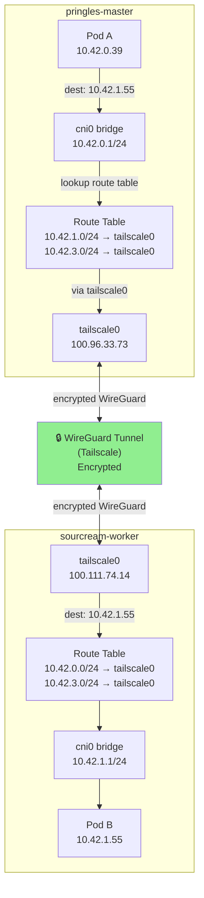
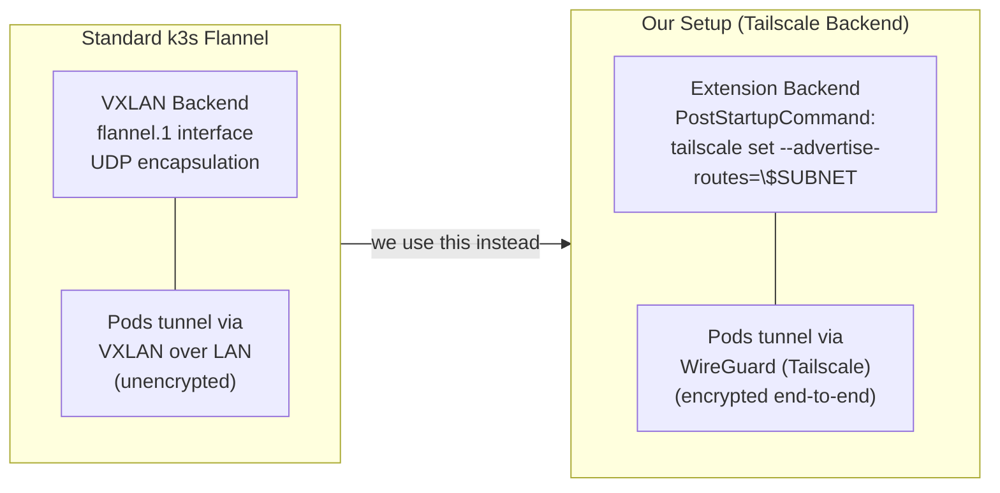
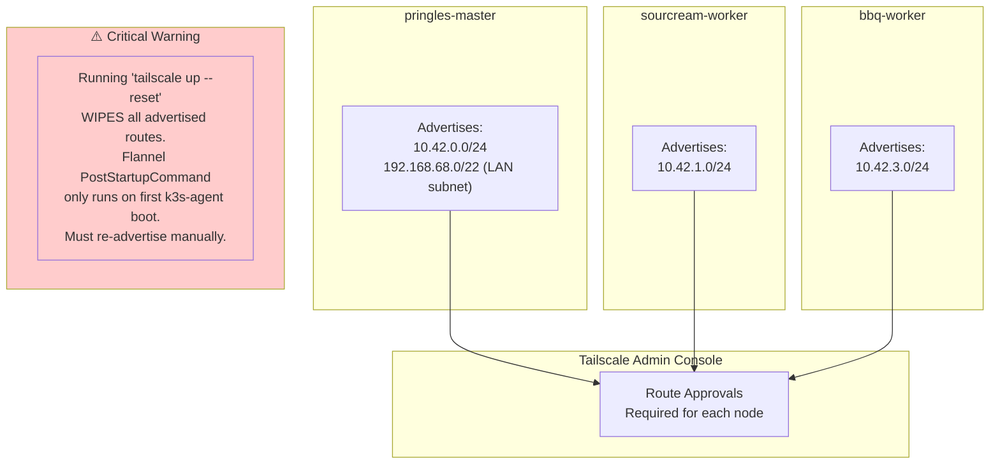
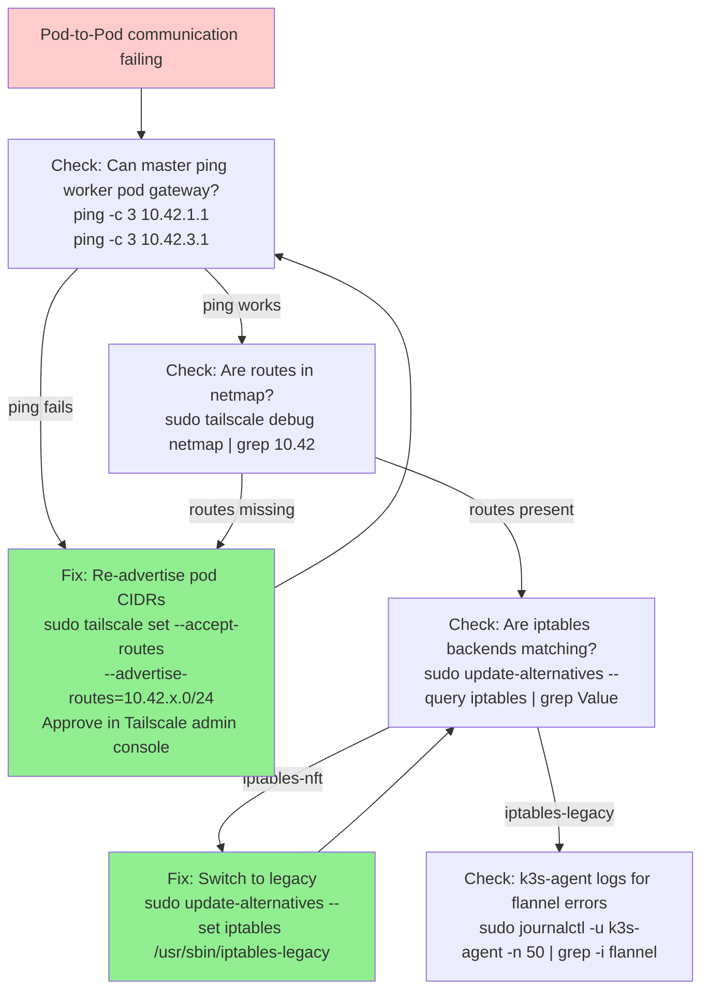

# Flannel + Tailscale Routing

## How Pod-to-Pod Traffic Flows Between Nodes

## Flannel Backend Configuration

## Route Advertisement — What Must Stay Configured

## Debugging Cross-Node Routing

