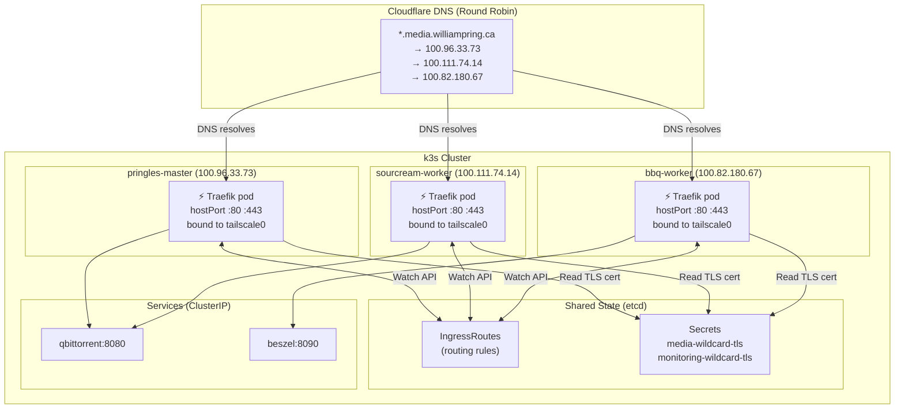
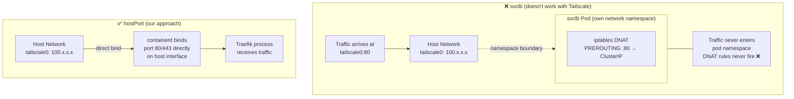
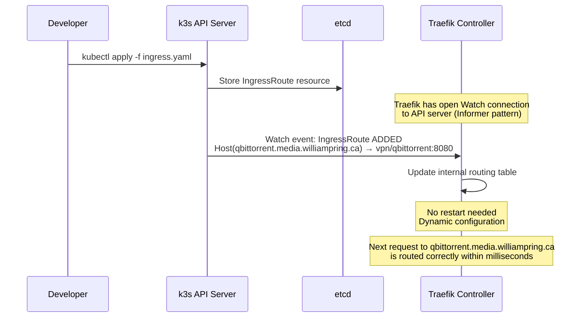

# Ingress Stack

## Traefik DaemonSet — High Availability Ingress

```mermaid
graph TB
    subgraph DNS["Cloudflare DNS (Round Robin)"]
        CF["*.media.williampring.ca\n→ 100.96.33.73\n→ 100.111.74.14\n→ 100.82.180.67"]
    end

    subgraph Cluster["k3s Cluster"]
        subgraph Master["pringles-master (100.96.33.73)"]
            TR_M["⚡ Traefik pod\nhostPort :80 :443\nbound to tailscale0"]
        end

        subgraph W1["sourcream-worker (100.111.74.14)"]
            TR_W1["⚡ Traefik pod\nhostPort :80 :443\nbound to tailscale0"]
        end

        subgraph W2["bbq-worker (100.82.180.67)"]
            TR_W2["⚡ Traefik pod\nhostPort :80 :443\nbound to tailscale0"]
        end

        subgraph State["Shared State (etcd)"]
            IR["IngressRoutes\n(routing rules)"]
            CERT["Secrets\nmedia-wildcard-tls\nmonitoring-wildcard-tls"]
        end

        subgraph Services["Services (ClusterIP)"]
            QB_SVC["qbittorrent:8080"]
            BSZ_SVC["beszel:8090"]
        end
    end

    CF -->|"DNS resolves"| TR_M
    CF -->|"DNS resolves"| TR_W1
    CF -->|"DNS resolves"| TR_W2

    TR_M <-->|"Watch API"| IR
    TR_W1 <-->|"Watch API"| IR
    TR_W2 <-->|"Watch API"| IR

    TR_M -->|"Read TLS cert"| CERT
    TR_W1 -->|"Read TLS cert"| CERT
    TR_W2 -->|"Read TLS cert"| CERT

    TR_M --> QB_SVC
    TR_W1 --> QB_SVC
    TR_W2 --> BSZ_SVC
```

## Why hostPort Over svclb LoadBalancer

```mermaid
graph TB
    subgraph svclb["❌ svclb (doesn't work with Tailscale)"]
        HOST1["Host Network\ntailscale0: 100.x.x.x"]
        subgraph SVCLB_POD["svclb Pod (own network namespace)"]
            RULE["iptables DNAT\nPREROUTING :80 → ClusterIP"]
        end
        TRAFFIC["Traffic arrives at\ntailscale0:80"]
        NOTE1["Traffic never enters\npod namespace\nDNAT rules never fire ❌"]

        TRAFFIC --> HOST1
        HOST1 -.->|"namespace boundary"| SVCLB_POD
        SVCLB_POD --- NOTE1
    end

    subgraph hostPort["✅ hostPort (our approach)"]
        HOST2["Host Network\ntailscale0: 100.x.x.x"]
        CONTAINERD["containerd binds\nport 80/443 directly\non host interface"]
        TRAEFIK["Traefik process\nreceives traffic"]

        HOST2 -->|"direct bind"| CONTAINERD
        CONTAINERD --> TRAEFIK
    end
```

## IngressRoute — How Traefik Learns Routes

```mermaid
sequenceDiagram
    participant Dev as Developer
    participant API as k3s API Server
    participant etcd as etcd
    participant Traefik as Traefik Controller

    Dev->>API: kubectl apply -f ingress.yaml
    API->>etcd: Store IngressRoute resource

    Note over Traefik: Traefik has open Watch connection<br/>to API server (Informer pattern)

    API->>Traefik: Watch event: IngressRoute ADDED<br/>Host(qbittorrent.media.williampring.ca) → vpn/qbittorrent:8080

    Traefik->>Traefik: Update internal routing table
    Note over Traefik: No restart needed<br/>Dynamic configuration

    Note over Traefik: Next request to qbittorrent.media.williampring.ca<br/>is routed correctly within milliseconds
```
