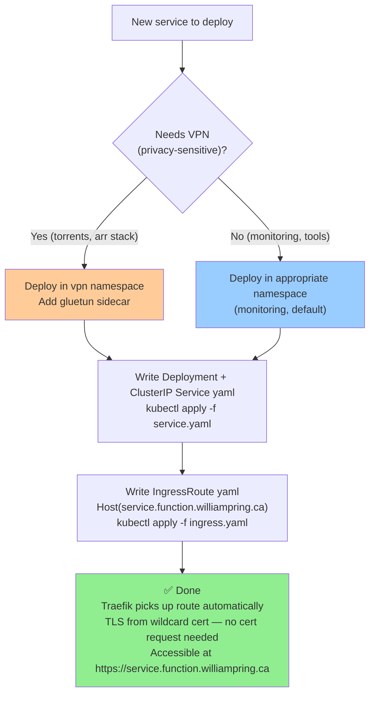
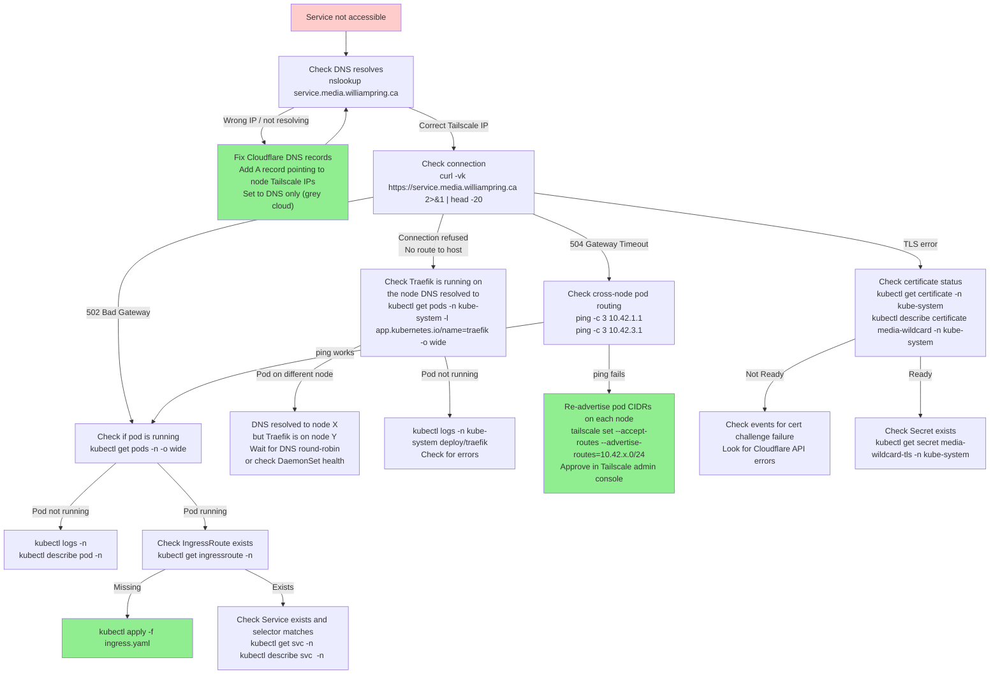

# Decision Flowcharts

## Adding a New Service — Self-Service Platform

```mermaid
flowchart TD
    START["New service to deploy"] --> Q1

    Q1{"Needs VPN\n(privacy-sensitive)?"}
    Q1 -->|"Yes (torrents, arr stack)"| VPN_NS
    Q1 -->|"No (monitoring, tools)"| NORMAL_NS

    VPN_NS["Deploy in vpn namespace\nAdd gluetun sidecar"] --> DEPLOY
    NORMAL_NS["Deploy in appropriate namespace\n(monitoring, default)"] --> DEPLOY

    DEPLOY["Write Deployment + ClusterIP Service yaml\nkubectl apply -f service.yaml"] --> INGRESS

    INGRESS["Write IngressRoute yaml\nHost(service.function.williampring.ca)\nkubectl apply -f ingress.yaml"] --> DONE

    DONE["✅ Done\nTraefik picks up route automatically\nTLS from wildcard cert — no cert request needed\nAccessible at https://service.function.williampring.ca"]

    style DONE fill:#90EE90
    style VPN_NS fill:#ffcc99
    style NORMAL_NS fill:#99ccff
```

## Troubleshooting Decision Tree

```mermaid
flowchart TD
    START["Service not accessible"] --> DNS_CHECK

    DNS_CHECK["Check DNS resolves\nnslookup service.media.williampring.ca"]
    DNS_CHECK -->|"Wrong IP / not resolving"| DNS_FIX
    DNS_CHECK -->|"Correct Tailscale IP"| CONN_CHECK

    DNS_FIX["Fix Cloudflare DNS records\nAdd A record pointing to node Tailscale IPs\nSet to DNS only (grey cloud)"]
    DNS_FIX --> DNS_CHECK

    CONN_CHECK["Check connection\ncurl -vk https://service.media.williampring.ca 2>&1 | head -20"]
    CONN_CHECK -->|"Connection refused\nNo route to host"| TRAEFIK_CHECK
    CONN_CHECK -->|"502 Bad Gateway"| POD_CHECK
    CONN_CHECK -->|"504 Gateway Timeout"| ROUTING_CHECK
    CONN_CHECK -->|"TLS error"| CERT_CHECK

    TRAEFIK_CHECK["Check Traefik is running on\nthe node DNS resolved to\nkubectl get pods -n kube-system -l app.kubernetes.io/name=traefik -o wide"]
    TRAEFIK_CHECK -->|"Pod on different node"| TRAEFIK_NODE
    TRAEFIK_CHECK -->|"Pod not running"| TRAEFIK_LOGS

    TRAEFIK_NODE["DNS resolved to node X\nbut Traefik is on node Y\nWait for DNS round-robin\nor check DaemonSet health"]

    TRAEFIK_LOGS["kubectl logs -n kube-system deploy/traefik\nCheck for errors"]

    POD_CHECK["Check if pod is running\nkubectl get pods -n <namespace> -o wide"]
    POD_CHECK -->|"Pod not running"| POD_LOGS
    POD_CHECK -->|"Pod running"| INGRESS_CHECK

    POD_LOGS["kubectl logs -n <namespace> <pod>\nkubectl describe pod -n <namespace> <pod>"]

    INGRESS_CHECK["Check IngressRoute exists\nkubectl get ingressroute -n <namespace>"]
    INGRESS_CHECK -->|"Missing"| APPLY_INGRESS
    INGRESS_CHECK -->|"Exists"| SVC_CHECK

    APPLY_INGRESS["kubectl apply -f ingress.yaml"]

    SVC_CHECK["Check Service exists and selector matches\nkubectl get svc -n <namespace>\nkubectl describe svc <name> -n <namespace>"]

    ROUTING_CHECK["Check cross-node pod routing\nping -c 3 10.42.1.1\nping -c 3 10.42.3.1"]
    ROUTING_CHECK -->|"ping fails"| ROUTE_FIX
    ROUTING_CHECK -->|"ping works"| POD_CHECK

    ROUTE_FIX["Re-advertise pod CIDRs on each node\ntailscale set --accept-routes --advertise-routes=10.42.x.0/24\nApprove in Tailscale admin console"]

    CERT_CHECK["Check certificate status\nkubectl get certificate -n kube-system\nkubectl describe certificate media-wildcard -n kube-system"]
    CERT_CHECK -->|"Not Ready"| CERT_EVENTS
    CERT_CHECK -->|"Ready"| SECRET_CHECK

    CERT_EVENTS["Check events for cert challenge failure\nLook for Cloudflare API errors"]

    SECRET_CHECK["Check Secret exists\nkubectl get secret media-wildcard-tls -n kube-system"]

    style START fill:#ffcccc
    style DNS_FIX fill:#90EE90
    style ROUTE_FIX fill:#90EE90
    style APPLY_INGRESS fill:#90EE90
```
